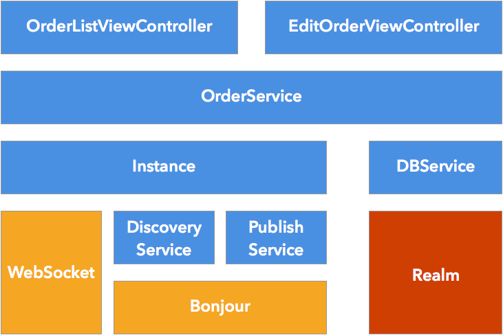
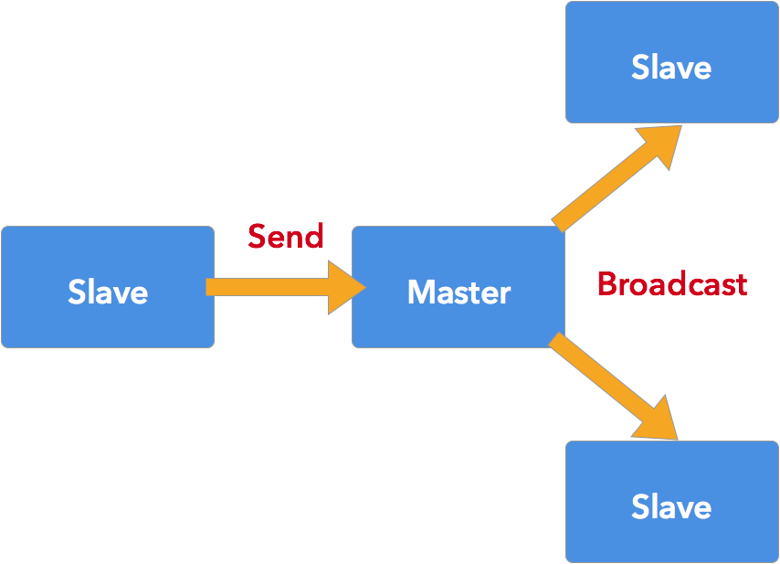

# Architecture



## Modules
This application follows MVC design pattern. Modules with blue background are developed by me, modules with yellow background are network libraries used by this application, and module with red background is  database library.

## Responsibility
View controllers only interact with OrderService, and OrderService will coordinate instance and DBService to execute corresponding tasks. DBService is responsible for CRUD in local database. Instance is responsible for publishing/discovering service and sending/receiving message from socket. We have two kinds of instance, one is master, the other is slave, they are slightly different from each other. Master instance will start publishing service after being initialized, and it broadcasts order operarion to all slaves. Slave instance will start discovering service after being initialized, and it only sends order operarion to master.

# Network


Slave uses Bonjour to find master in LAN, then use hostname and port provided by Bonjour to connect to master by WebSocket. When slave is managing order data, 
slave sends data to master, and master will broadcast to all slaves.

# Data format
The format is based on JSON.

Bellow is an example data transmitted between master and slaves. 

```
{  
   "operation":0,
   "order":{  
      "uuid":"4E97A130-C151-42A1-B6BE-247059539BC8",
      "customerName":"Kevin",
      "created":"2016-01-09T23:15:34+0800",
      "shippingMethod":"DHL",
      "tableSize":-1
   }
}
```

Operation is defined in OrderNotification.h

```
typedef enum : NSUInteger {
    Create,
    Update,
    Remove,
} Operation;
```

So we know 'Create' is 0, 'Update' is 1, 'Remove' is 2.

After receiving data, master or slave parses received JSON and executes corresponding operation denpend on the 'operation' field in JSON.

# Installation
Install StorePOSMaster as master in simulator or device, and install StorePOS as slave in other simulators or devices. The sequence of app execution is arbitrary, just make sure they are in the same local area network.

# Feature
Support

* Add order
* Remove single order or multiple orders
* Update order

# Unit test
Hit ⌘U in Xcode.

# Roadmap

* Send multiple order records in one message
* Synchronize master ans slaves data after socket is connected
* Handle error generated by OrderService